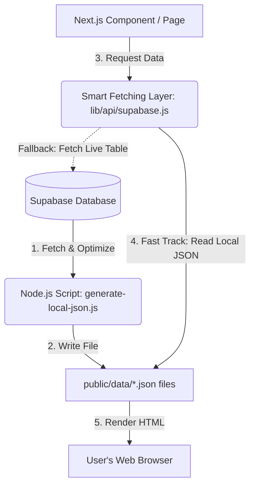

# End-to-End Portfolio Data Architecture

This document explains in simple terms how data flows from your database, gets saved into static JSON files, and is ultimately displayed on your website.

---

## 🗺️ The Big Picture

Your portfolio website uses a **Hybrid Static Site Generation (SSG)** pattern. 
Instead of making database calls every single time a visitor opens your website (which is slow and can cost money), the website fetches database contents *during the build process*, writes them into static JSON files, and renders those files.

Here is the step-by-step flow:

---

## 🛠️ Step-by-Step Architecture Flow

### Step 1: The Source of Truth (Supabase Database)
All your portfolio details are stored in structured tables in a cloud database called **Supabase**:
- **`bio`**: Your name, titles, profile photo, and overview description.
- **`projects`**: Project titles, timelines, descriptions, tags, and links.
- **`skills`** & **`skill_categories`**: List of tools/technologies you know.
- **`experiences`** & **`education`**: Work history and school details.
- **`blog_posts`**: Written articles.

---

### Step 2: The Collector (JSON Generation Script)
When you run a build or start development, a custom Node.js script (`scripts/generate-local-json.js`) triggers.
1. **Connection:** It logs in securely to your Supabase database using API keys.
2. **Download:** It downloads all rows from each of the tables.
3. **Optimization:** It automatically cleans the data (e.g., removing heavy base64-encoded image strings to keep files lightweight).
4. **Writing:** It saves the data into simple text files inside the `public/data/` folder:
   - `public/data/profile.json`
   - `public/data/projects.json`
   - `public/data/skills.json`
   - `public/data/experience.json`
   - `public/data/education.json`
   - `public/data/blogs.json`

---

### Step 3: The Smart Gatekeeper (lib/api/supabase.js)
When the website needs data, it calls functions in `lib/api/supabase.js` (e.g., `fetchProjects()`). This file contains smart double-checks:
- **Priority Check:** It first looks inside your project's local folders for the corresponding static file (like `public/data/projects.json`).
- **If Found:** It reads the JSON file instantly. This is extremely fast (takes less than 1 millisecond) and uses **0%** of your database API limits.
- **If Missing:** If you deleted the JSON files, it falls back to making a live query over the internet to Supabase, ensuring your website never breaks.

---

### Step 4: The Render (React & Next.js Components)
The pages (like `app/page.js`) receive the database data from the smart gatekeeper and pass it down to your UI components (like `HomeClient.js`):
- React loops through the list of projects or skills.
- It inserts the information into your HTML and styles it using your **Glassmorphic components**.
- Next.js compiles the entire app into a folder of static web pages (`out/`).

---

### Step 5: Hosting & Loading (GitHub Pages)
When you deploy the site:
1. You run `npm run deploy`.
2. Next.js turns the website into basic HTML, CSS, JavaScript, and JSON files inside the `out/` folder.
3. These static files are uploaded to **GitHub Pages**.
4. When a user visits your portfolio:
   - They load pre-built HTML and static JSON files.
   - The site loads **instantly** because there is no server-side database lookup when a user opens the page.
   - The hosting is **100% free** and can easily handle millions of visitors without scaling costs.

---

## 💡 Why This Setup is Excellent for Portfolios

1. **Speed:** Page loads are nearly instant.
2. **Cost-Free:** Running database queries on every page load can exhaust free tiers; static files keep Supabase queries at zero at runtime.
3. **SEO Friendly:** Search engines like Google can crawl the pre-built HTML immediately since all data is already baked in.
4. **Offline Capability:** If you configure a Service Worker, the static JSONs can be cached on the user's browser, allowing the site to work offline.
